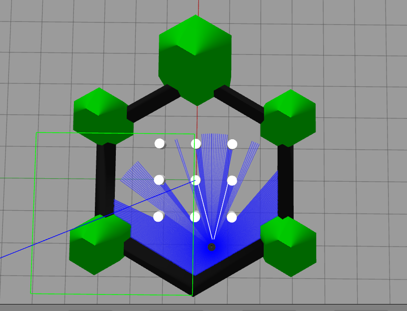
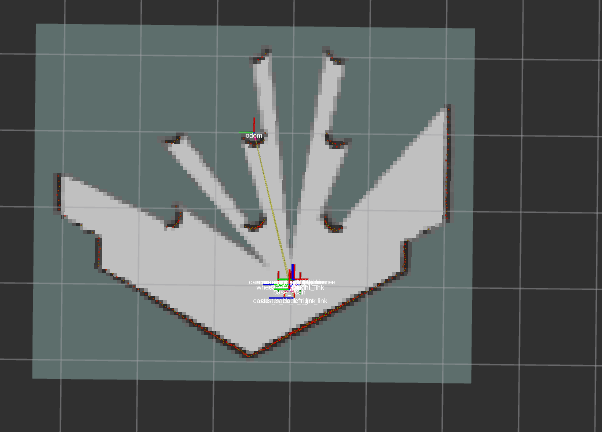

## Turtlebot3-Navigation2
To enable autonomous navigation, we use the **Nav2 (Navigation 2) package** — a powerful ROS 2-based framework that allows a robot to move safely from one point to another. Nav2 handles essential tasks such as path planning, obstacle avoidance, and localization, significantly reducing the time and effort required to implement navigation from scratch. The process begins by creating a map of the environment using SLAM (Simultaneous Localization and Mapping). Once the map is built, the robot can be instructed to navigate from point A to point B autonomously using the Nav2 stack.

## Table of Contents

1. [Installation](#installation)
    - [System Preparation & Package Installation]
    - [Cloning and Building the Workspace]
3. [Start Simulation Environment](#usage)
   - [Terminal 1: Starts Gazebo]
   - [Terminal 2: Starts Teleop Keyboard]
   - [Terminal 3: Starts RVIZ]
4. [Save Map](#SaveMap)
5. [Launching Nav2 and Navigating in Simulation](#gazebo-simulation)


## Installation
#### System Preparation & Package Installation
```shell
sudo apt update
sudo apt install ros-humble-navigation2 ros-humble-nav2-bringup ros-humble-turtlebot3*
```
#### Cloning and Building the Workspace
```shell
cd ~/turtlebot3_ws/src
git clone https://github.com/IsraelAfriyie-dev/Turtlebot3-Navigation2.git
cd ~/turtlebot3_ws
rosdep install --from-paths src -r -y
colcon build
```

## Start Simulation Environment 
Specify which turlebot3 you need in your environement( Burger, waffle ... etc)
```shell
gedit ~/.bashrc 
export TURTLEBOT3_MODEL=waffle
```
#### Open terminal 1 
This terminal launch gazebo app.
```shell
ros2 launch turtlebot3_gazebo turtlebot3_world.launch.py
```
<div align="center">
    
</div>

#### Open terminal 2
this terminal starts a node for controlling the robot move in Gazebo 
```shell
ros2 run turtlebot3_teleop teleop_keyboard
```
#### Open terminal 3
This terminal creates the map with SLAM with RVIZ Software
```shell
ros2 launch turtlebot3_cartographer cartographer.launch.py use_sim_time:=True
```
<div align="center">
    
</div>

## Save Map
Open a new terminal to save map to new directory
```shell
mkdir map 
ros2 run nav2_map_server map_saver_cli-f map/my_map
 ```
## Launching Nav2 and Navigating in Simulation
Close all active terminals to ensure a clean setup. Now you're ready to begin navigation using the map you previously created.
start Terminal 1
```shell
ros2 launch turtlebot3_gazebo turtlebot3_world.launch.py
```
Start Terminal 2
```shell
ros2 launch turtlebot3_navigation2 navigation2.launch.py use_sim_time:=True map:=map/my_map.yaml) 
```
Once the map loads in RViz, provide an approximate starting position for the robot by referencing its location in Gazebo. 
Use the "2D Pose Estimate" tool in RViz to click and set the robot’s initial pose. 
Then, use the "Nav2 Goal" tool to define the destination by clicking on the map. The robot will begin navigating to the specified goal.
